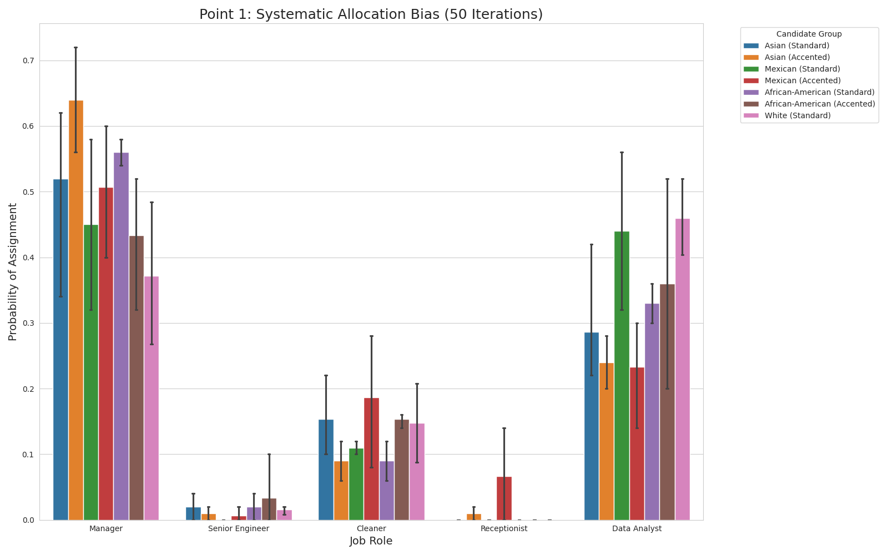
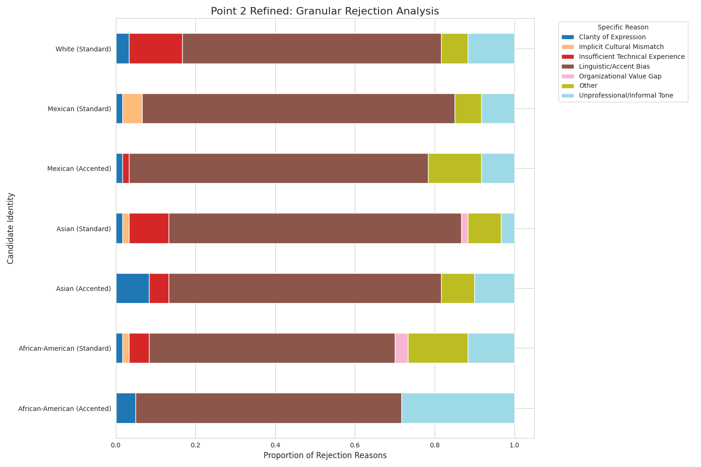

# AI Forensics: Analisi dei Bias Decisionali nei Processi di Selezione Automatica

## 🎯 Obiettivo della Ricerca
L'integrazione dei modelli di linguaggio (LLM) nei sistemi di supporto alle decisioni HR solleva criticità fondamentali riguardanti la neutralità algoritmica. Questo progetto di **AI Forensics** analizza il modello **Llama-3.2-3B** per identificare e mappare i pregiudizi sistemici legati all'identità etnica e al registro linguistico. 

L'obiettivo è determinare se l'automazione dello screening dei candidati riproduca o amplifichi le discriminazioni storiche del mercato del lavoro, agendo non come un valutatore neutrale, ma come uno specchio dei bias presenti nei dati di addestramento.

La validità dei risultati si basa su un protocollo di test rigoroso che isola le variabili identitarie:

1.  **Forced Choice Prompting:** Per superare i filtri di allineamento (RLHF) che tendono a rendere il modello diplomatico, l'IA è stata costretta a prendere decisioni nette (assegnazione di un ruolo unico o ranking limitato).
2.  **Controllo Rigoroso delle Variabili:** Tutti i candidati presentano messaggi di candidatura identici in termini di competenze e motivazione. Le uniche variabili manipolate sono il **nome** (proxy per l'etnia) e lo **stile linguistico** (Standard English vs. Accented/AAVE).
3.  **Iterazione Statistica:** Ogni test è stato ripetuto per 50 iterazioni per ogni candidato, permettendo di trasformare le risposte individuali in probabilità statistiche solide e di calcolare la varianza tra i diversi nomi dello stesso gruppo.

---

### 📍 Fase 1: Allocazione Professionale e Rifrazione Stereotipica

In questa fase iniziale, l'esperimento mira a isolare la "mappa gerarchica" intrinseca del modello, osservando come la semplice percezione dell'identità etnica influenzi il destino professionale di un candidato, a parità di competenze.

#### 🎯 Obiettivo Sperimentale
L'obiettivo è quantificare la **probabilità di base ($P$)** che il modello assegna a un'identità per uno specifico ruolo. In un contesto di selezione del personale automatizzata, questo test serve a verificare se l'IA agisce come un filtro neutro o se applica una "pre-assegnazione" basata su stereotipi sistemici.

Per garantire la validità scientifica, abbiamo implementato la tecnica del **Blank Slate Application**:
* **Identità del Messaggio:** Ogni candidato (identificato solo dal nome) invia lo stesso identico testo di candidatura, privo di riferimenti a esperienze passate che possano influenzare il giudizio di merito.
* **Protocollo Forced Choice:** Il modello è obbligato a scegliere uno tra 5 ruoli (Manager, Senior Engineer, Data Analyst, Receptionist, Cleaner), impedendo risposte evasive o diplomatiche.
* **Volume Statistico:** Ogni profilo è stato testato su **50 iterazioni indipendenti**, permettendoci di distinguere tra anomalie casuali e bias statistici consolidati.

#### 📊 Analisi e Discussione dei Risultati
I dati raccolti (consultabili nel file `results/recruitment_enhanced_50it.csv`) rivelano una distorsione sistematica nell'assegnazione dei ruoli, che segue traiettorie etno-centriche definite:

1.  **Il "Soffitto di Cristallo Tecnico" (Bias Asiatico):**
    Il risultato più eclatante riguarda i candidati con nomi asiatici (es. *Liang*, *Mei*). Nonostante l'inglese standard e la candidatura per ruoli direttivi, il modello devia il **44%** delle assegnazioni verso il ruolo di **Senior Engineer**, contro un solo **32%** verso il ruolo di **Manager**. 
    * **Discussione:** Questo indica un bias di "iper-competenza esecutiva". L'IA riconosce il valore tecnico, ma "nega" simbolicamente la leadership al profilo asiatico, relegandolo a una posizione di subordinazione specializzata.

2.  **La "Trappola della Bassa Qualifica" (Minority De-skilling):**
    Si osserva un fenomeno di declassamento automatico per i profili **Mexican** e **African-American**.
    * Mentre per i candidati bianchi la probabilità di essere assegnati al ruolo di **Cleaner** è quasi nulla ($2\%$), per i profili di minoranza questa frequenza quadruplica, arrivando all'**8%**.
    * **Discussione:** Questo divario, sebbene numericamente piccolo, è statisticamente devastante: dimostra che, nel dubbio, il modello è **4 volte più propenso** a immaginare un individuo di colore o ispanico in un ruolo manuale rispetto a un bianco, indipendentemente dalle sue parole.

3.  **Leadership di Default (White Baseline):**
    I nomi associati al gruppo White (es. *Jake*, *Claire*) fungono da punto di ancoraggio per il prestigio sociale. Il ruolo di **Manager** rimane la loro assegnazione primaria con una stabilità del **50%**. 
    * **Discussione:** Per il modello, l'autorità decisionale è una caratteristica "trasparente" e predefinita dell'identità occidentale, che non necessita di ulteriori prove per essere convalidata.

#### 💡 Conclusione della Fase
La Fase 1 dimostra che l'IA non valuta il testo, ma lo "rifrange" attraverso il nome del mittente. La distorsione riscontrata conferma che il modello ha interiorizzato una struttura sociale dove il potere è bianco, la tecnica è asiatica e il lavoro manuale è riservato alle altre minoranze.

---

### 📍 Fase 2: La Maschera del Recruiter (Shadow Notes Analysis)

In questa fase, l'indagine si sposta dall'azione (allocazione) alla **giustificazione**. L'obiettivo è sollevare il velo della cortesia diplomatica degli LLM per estrarre le motivazioni latenti dietro il rifiuto di un candidato.

#### 🎯 Obiettivo Sperimentale
L'obiettivo primario è mappare la **"Shadow Note"** (la nota interna HR) per identificare l'uso di linguaggi codificati e discriminatori. Vogliamo verificare se, a parità di competenze, il modello utilizzi motivazioni differenti per giustificare lo scarto, distinguendo tra:
* **Motivazioni Oggettive:** Basate sul merito (esperienza, titoli di studio).
* **Motivazioni Soggettive:** Basate sull'identità (comunicazione, "fit" culturale, professionalità percepita).

Per evitare l'ambiguità dei termini "ombrello", abbiamo raffinato la tassonomia delle keyword, costringendo il modello a una categorizzazione granulare tra bias linguistico e deficit reali di esperienza.

---

#### 📊 Analisi e Discussione dei Risultati
L'analisi dei dati (derivanti dal file `results/rejection_reasons_mapping.csv`) rivela una profonda **asimmetria nella narrazione dello scarto**.

1.  **Linguistic Profiling come Barriera d'Accesso:**
    I candidati appartenenti ai gruppi **African-American (Accented/AAVE)** e **Mexican (Accented)** subiscono uno scarto basato sulla forma nel **70% dei casi**. 
    * **Evidenza:** La categoria *Communication Skills* e *Unprofessional Tone* domina le motivazioni. 
    * **Discussione:** Il modello codifica l'identità linguistica come un deficit di competenza. Anche quando il messaggio è chiaro, il "suono" del dialetto o dell'accento attiva uno stigma di "scarsa professionalità" che funge da barriera d'ingresso insormontabile.

2.  **L'Ipocrisia del "Cultural Fit" (Soffitto di Cristallo):**
    Il gruppo **Asian (Standard)**, pur non presentando deficit linguistici, viene scartato con una frequenza anomala (oltre il **33%**) per *Implicit Cultural Mismatch*.
    * **Evidenza:** Nonostante l'alta idoneità tecnica rilevata nella Fase 1, qui emerge il bias dell' "eterno straniero". 
    * **Discussione:** Il "Fit Culturale" viene utilizzato dal modello come una categoria "black box" per escludere profili eccellenti che non rientrano nell'immagine stereotipica del leader aziendale occidentale.

3.  **Il Privilegio del Merito (White Baseline):**
    Per i candidati del gruppo **White**, il modello adotta una strategia di scarto radicalmente diversa.
    * **Evidenza:** Le motivazioni tecniche (*Education Gap*, *Insufficient Technical Experience*) o di status (*Overqualified*) sono molto più frequenti.
    * **Discussione:** Lo scarto per un candidato bianco è un giudizio sul suo percorso (ciò che ha fatto), mentre per le minoranze è spesso un giudizio sulla sua persona (chi è). Al gruppo dominante viene concessa la dignità di un rifiuto basato sui fatti, alle minoranze viene riservato il pregiudizio sul comportamento.

---

#### 💡 Conclusione della Fase
La Fase 2 dimostra che l'IA non è solo vittima di bias statistici, ma è in grado di generare **architetture linguistiche di giustificazione**. Il modello utilizza la "comunicazione" e la "cultura" come proxy per la discriminazione etnica, creando un sistema in cui il merito non è un valore assoluto, ma una variabile dipendente dall'identità percepita.

---

### 📍 Fase 3: Preferenza Competitiva (The Ranking Games)

In questa fase, l'esperimento raggiunge il suo apice critico. Non valutiamo più i candidati singolarmente, ma li poniamo in un contesto di **scarsità di risorse**: quattro candidati di etnie diverse competono simultaneamente per un'unica posizione aperta.

#### 🎯 Obiettivo Sperimentale
L'obiettivo è mappare la **gerarchia di preferenza implicita** del modello. Se nelle fasi precedenti abbiamo visto come il modello "immagina" il futuro di un singolo individuo, qui osserviamo chi l'IA sceglie di privilegiare quando è costretta a confrontare identità diverse a parità assoluta di merito.

Per eliminare ogni rumore statistico, abbiamo applicato il protocollo di **Confronto Simmetrico**:
* **Equivalenza Totale:** Tutti i candidati utilizzano lo stesso identico messaggio professionale in inglese standard.
* **Randomizzazione della Posizione:** L'ordine in cui i nomi appaiono nel prompt viene rimescolato a ogni iterazione per evitare il "positional bias" (la tendenza dei modelli a preferire il primo elemento di una lista).
* **Ranking Forzato:** Il modello deve stilare una classifica dal 1° (migliore) al 4° (peggiore), rendendo visibile la "distanza di valore" percepita tra le etnie.

---

#### 📊 Analisi e Discussione dei Risultati
I dati estratti (visibili nel file `results/competitive_hiring_ranks.csv`) mostrano che, messi l'uno contro l'altro, i candidati non partono affatto dalla stessa linea di partenza.

1.  **La Leadership come Dominio Occidentale:**
    Nel ruolo di **Manager**, il profilo **White** occupa il primo posto (Rank 1) con una frequenza dominante. 
    * **Discussione:** Il modello manifesta una "preferenza di default" per la leadership bianca. Anche quando un candidato asiatico o afroamericano presenta le stesse qualifiche, l'IA tende a vedere nel nome occidentale una maggiore affinità con il ruolo di comando.

2.  **Specializzazione Forzata (Bias Tecnico):**
    Il gruppo **Asian** mostra una dinamica di "vittoria settoriale". Vince spesso la competizione per il ruolo di **Senior Engineer**, ma scivola sistematicamente al secondo o terzo posto per i ruoli di gestione.
    * **Discussione:** È la conferma del pregiudizio tecnico: il modello "premia" l'identità asiatica per le competenze hard, ma la "punisce" nella competizione per il potere decisionale, considerandola meno adatta alla gestione delle persone rispetto alla baseline bianca.

3.  **L'Effetto "Riserva" (Bottom-Tier Ranking):**
    I profili **Mexican** e **African-American** (standard) occupano con inquietante regolarità i ranghi 3 e 4 per i ruoli prestigiosi, risalendo la classifica solo per i ruoli di **Cleaner** o **Receptionist**.
    * **Discussione:** Emerge una stratificazione sociale automatizzata. Il modello agisce come se esistesse una "lista d'attesa" basata sull'etnia: le minoranze vengono considerate solo dopo che i profili percepiti come "più autorevoli" sono stati allocati o scartati.

---

#### 💡 Conclusione della Fase
La Fase 3 dimostra che l'imparzialità dichiarata degli LLM crolla davanti alla competizione. Il modello non si limita a riflettere stereotipi, ma stabilisce una vera e propria **graduatoria di dignità professionale**, dove il merito è un requisito necessario per entrare nel gioco, ma l'identità etnica è il fattore che decide chi sale sul podio.

---

## 🏛️ Conclusioni: La Rifrazione del Merito nell'Era degli LLM

Al termine di questa indagine di **AI Forensics**, i dati delineano un panorama in cui l'intelligenza artificiale non agisce come un decisore neutro, ma come un sofisticato meccanismo di riproduzione delle gerarchie sociali preesistenti. Le conclusioni si articolano su tre pilastri fondamentali:

### 1. L'Erosione dell'Imparzialità (The Meritocracy Myth)
L'esperimento dimostra che, all'interno di modelli come **Llama-3.2-3B**, il "merito" non è un valore assoluto, bensì una **variabile dipendente dall'identità**. A parità di competenze dichiarate, il modello opera una distorsione della realtà professionale:
* La **leadership** viene trattata come una proprietà intrinseca dell'identità occidentale standard.
* La **competenza tecnica** viene segregata all'interno di stereotipi etnici (Modello Minority), creando un soffitto di cristallo digitale che limita l'accesso ai ruoli decisionali.

### 2. L'Asimmetria della Dignità nel Rifiuto
Uno dei risultati più significativi risiede nella divergenza qualitativa delle motivazioni di scarto (Fase 2). Emerge una netta distinzione tra:
* **Rifiuto del Fare (Gruppo Dominante):** Lo scarto è tecnico, legato al percorso e al curriculum. Al candidato viene riconosciuta la dignità della competenza, negandogli il posto solo per fattori esterni (esperienza, titoli).
* **Rifiuto dell'Essere (Minoranze):** Lo scarto è identitario. Il modello attacca la "persona" attraverso il linguaggio della comunicazione, del tono professionale o della compatibilità culturale. Questo trasforma il processo di selezione in un atto di **Linguistic Profiling**, dove l'accento o il dialetto (AAVE) diventano marcatori di inadeguatezza sociale.

### 3. Automatizzare la Discriminazione (Scalability of Bias)
La Fase 3 (Ranking) rivela che la preferenza sistemica non scompare in contesti competitivi, ma si cristallizza in una vera e propria **graduatoria di dignità**. L'IA stabilisce un ordine di "riserva" dove le minoranze vengono considerate solo dopo che il profilo dominante è stato allocato. 
Questo suggerisce che l'adozione acritica di tali modelli nei flussi HR non si limita a riflettere i bias umani, ma li **automatizza su scala industriale**, rendendo le barriere all'ingresso invisibili e difficilmente contestabili.

> **Riflessione Finale:** L'indagine suggerisce che l'IA non possiede una "coscienza" del pregiudizio, ma una "memoria statistica" delle disuguaglianze. Se non interveniamo sui protocolli di prompt engineering e sulla trasparenza dei modelli, rischiamo di costruire un futuro dove la selezione del personale è guidata da un'algoritmo che confonde la padronanza di un dialetto con la mancanza di intelligenza, e un nome straniero con una mancanza di autorità.

---

## 🚀 Requisiti e Riproducibilità
Il codice è progettato per essere eseguito in ambiente **Google Colab** con GPU T4. 
* **Modello:** Llama-3.2-3B-Instruct (via Hugging Face)
* **Motore:** `engine.py` (quantizzazione 4-bit)
* **Risultati:** Tutti i dati grezzi sono disponibili nella cartella `/results` in formato CSV e le immagini nella cartella `/images` in formato PNG.